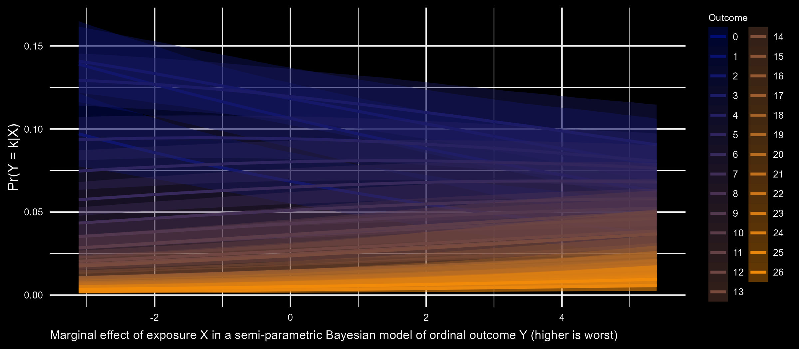

<!-- README.md is generated from README.Rmd. Please edit that file -->

```{r, include = FALSE}
dpi = 300
knitr::opts_chunk$set(
  collapse = TRUE,
  warning = FALSE,
  message = FALSE,
  echo = FALSE,
  dpi = dpi,
  comment = "#>"
)
```



## About me
* I am a biostatistician. I perform statistical analysis in mental health studies of mothers and children.
* I work mainly with longitudinal survey data, clinical psychology data, and genomics data.
* I enjoy persuading colleagues to switch to  and SQL.
* I am an  
enthusiast. My most favorite  📦s are `{data.table}`, `{brms}`, and `{ggplot2}`, ... and `{shiny}`, and `{tidyverse}`, and pretty much every package ...
* I also use [](https://mc-stan.org/) to 
do Bayesian statistics.
* I use 
mostly for web scraping, sci-kit learn, and potentially torch in the future.

## Packages
* R and Python machine learning 📦 [rpwf](https://hhp94.github.io/rpwf/): combining [`{tidymodels}`](https://www.tidymodels.org/) in R, and [scikit-learn](https://scikit-learn.org/) in python.  

## Links
* Using XGboost to predict cases of CVD in a Kaggle competition using both R and Python with 
[rpwf](hhp94.github.io/rpwf/), [`{tidymodels}`](https://www.tidymodels.org/) and [scikit-learn](https://scikit-learn.org/).  

## Socials
[](https://www.linkedin.com/in/hung-pham-3b3492113/)
