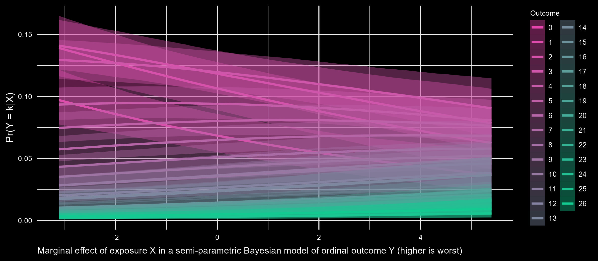

<!-- README.md is generated from README.Rmd. Please edit that file -->

## About me

<!-- badges: start -->

I am a biostatistician, modeling longitudinal mental health studies in
mothers and children. I am a

enthusiast. My most favorite

📦s are `{data.table}`, `{brms}`, and `{ggplot2}`. I also use

to perform Bayesian analysis. I use

mostly for web scraping, sci-kit learn, and potentially torch in the
future.  
<!-- badges: end -->

<!--  -->

## Links

Under Constructions

## Socials

